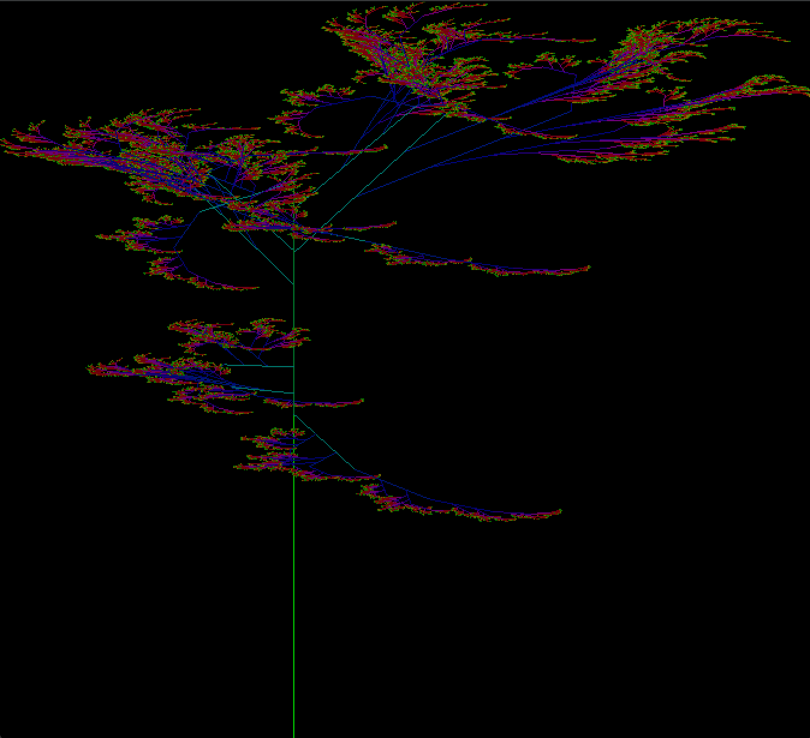

# Haskell L-Systems

A compact Haskell library and demo for exploring Lindenmayer systems (L-systems).

This repository implements several flavors of L-systems and simple renderers:

- Deterministic 2D L-systems (turtle graphics)
- Probabilistic / stochastic L-systems (reproducible via seeds)
- A 3D-like L-system renderer that projects 3D geometry to 2D

The project includes example systems (trees, a probabilistic bush, and a 3D "mandala" sphere) and a small OpenGL/GLUT-based drawing front-end.

<p align="center">
  
</p>

---

## Highlights

- Well-commented Haskell implementation showing:
  - L-system expansion and parsing (bracketed commands)
  - Multiple tracing strategies (recursive, explicit stack, tail-recursive)
  - Colour handling and hue cycling
  - Probabilistic rule selection with seeded RNG
  - Simple 3D frame math and projection to 2D

## Key modules

- `src/LSystems.hs` — core L-system types and algorithms (2D, probabilistic, 3D helpers)
- `src/Renderer.hs` — convenience drawing functions that call the tracer and `IC.Graphics`
- `src/Examples.hs` — example systems: `probBush`, `tree3D`, `mandala3D` (the mandala constructs a 3D-looking sphere)
- `src/IC/Graphics.hs` — small GLUT-based renderer (`drawLines`)
- `src/IC/Colour.hs` — colour helpers and hue-step function

## Build & run

This project is a Cabal Haskell package (see `lsystems.cabal` and `cabal.project`). Two common ways to try it:

1) Quick interactive (recommended)

```bash
# from project root
$ cabal repl
# draw the 3D Sphere
> drawSphere False
# draw the Probabilistic Lsystem for Bush.
# this will generate a different LSystem every time:
> drawProbLSystem2col False probBush 8 Green
# draw a regular 2D LSystem (the True setting makes it draw live!):
> drawLSystem2 True arrowHead 6 Red
```

<p align="center">
  
</p>

2) You can explore the `Examples.hs` for LSystem examples, which includes 2D, 3D and probabilistic systems. You can also define your own LSystems. The main functions to render LSystems are:

```bash
# This draws a regular 2D LSystem
> drawLSystem2
# This draws a 2D LSystem with changing colour
> drawLSystem2col
# This draws a probabilistic 2D LSystem
> drawProbLSystem2
# This draws a probabilistic 2D LSystem that outputs
# the same result each time the same seed is given
> drawProbLSystem2WithSeed
# This draws a probabilistic 2D LSystem with changing colour
> drawProbLSystem2col
# This draws the 3D Shere; a similar function can be used to
# draw any 3D LSystem you define. Feel free to adjust the parameters.
> drawSphere3D
```
